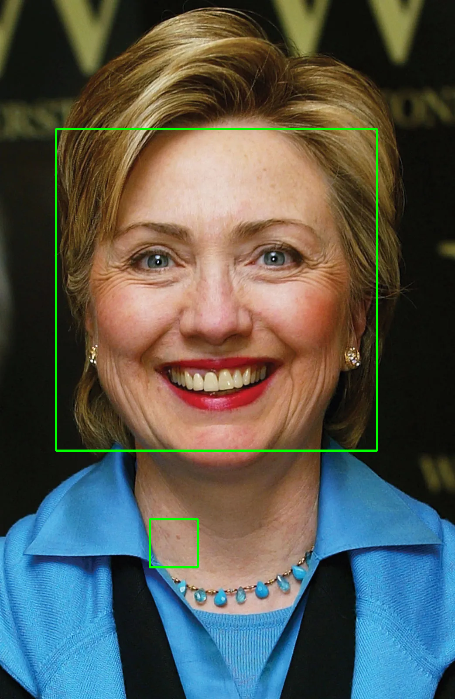

# Automatic Face Smoothing
 
This repository contains the Python package facesmoothing. This package aims to apply facial smoothing technique to human faces appear in images. Currently, the package uses openCV facial detection and bilateral filter features to detect faces and applying filter.

## Installation

You can clone the repository using git:
```
git clone https://github.com/IngKP/AutomaticFaceSmoothing.git
cd facesmoothing
```

Additionally, you can fork this repository and edit it on your local machine.

## Features

There are a few features available in 0.1.3 build, namely:

### Automatic face detection and smoothing
You can run `main.py`, input file path and additional data in cmd
```
input image file or directory: <imagePath>
input d, sigmaColor, sigmaSpace: <d sigmaColor sigmaSpace>
```
The default values are `9, 75, 75` respectively. Check [openCV bilateral filter](https://docs.opencv.org/4.x/d4/d86/group__imgproc__filter.html#ga9d7064d478c95d60003cf839430737ed) for more information.

Additionally, you can create another file and import smoothing function:
```
# in your python file or notebook
import facesmoothing.smoothing
facesmoothing.smoothing.smoothing(imagePath, d, sigmaColor, sigmaSpace, extension)
```

### heic to png
There is a built-in .heic to .png format in case you import the images from iphone. To do that, run heic2png.py:
```
Input file or path: <filePath>
```
insert your path in `<filePath>`

## Examples
Below is an example of the application using an image of Hillary Clinton (scott barbour/getty images)

Input Image |  Output Image
:-------------------------:|:-------------------------:
 | 


## Known Issues

### Performance issues:
The facial detection feature from openCV is still not perfect. As shown below, there will be some parts of the images that are recognized as faces even if it is not.

|  | 
|:--:| 
| Faces detected in an image|
## Development plan

- [x] Implement facial recognition using openCV
- [x] Implement smoothing filter using bilateral filter
- [x] Building package
- [ ] Made the package available on pypi
- [ ] Creating test files
- [ ] Further implement more techniques for detecting faces (check [AN ALGORITHM FOR AUTOMATIC SKIN SMOOTHING IN DIGITAL PORTRAITS](https://projet.liris.cnrs.fr/imagine/pub/proceedings/ICIP-2009/pdfs/0003149.pdf))
